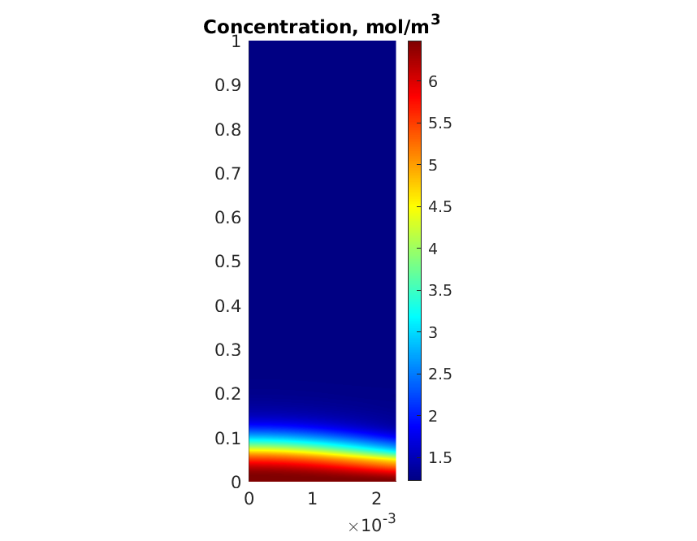

# supersaturation
This MATLAB program models vapor supersaturation in a laminar flow. It then uses the the solution to calculate the amount of vapor condensed on aerosol particles in the flow. Tube wall temperature profile is measured experimentally and provided in a csv file. The program then solves the heat PDE to find the temperature at all points in the flow:

    

The program assumes that vapor at the inlet and hear the tube wall is saturated. Based on that, it solves the diffusion PDE to find vapor concentration at every point in the flow:

    

The program then calculates vapor supersaturation, which is a function of temperature and vapor concentration:

    

    

Finally, the program solves an ODE to model vapor condensation on aerosol particles. The equation is solved at different radial positions and the solutions are averaged:

    

